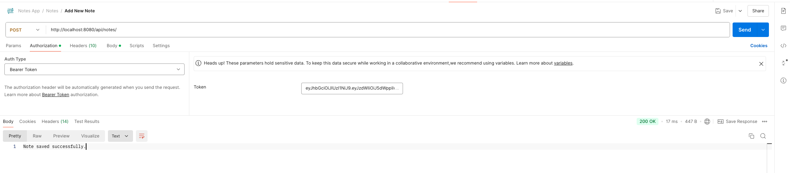
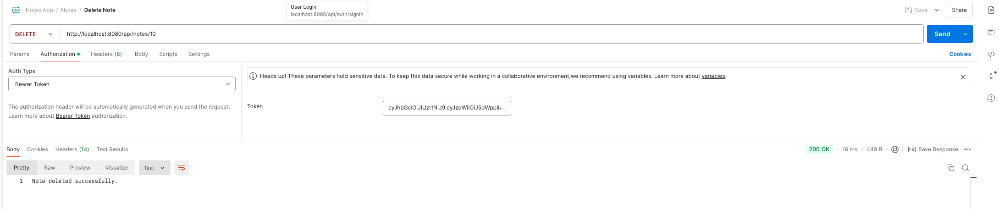

# Notes App Backend

## Overview

This project implements a robust RESTful API using Spring Boot with the following features:

- **JWT Token Authentication:** Secure user authentication using JSON Web Tokens.
- **Rate Limiting and Request Throttling:** Manage high traffic by limiting requests per user.
- **Search Functionality:** Efficient keyword-based search for user notes.

## API Endpoints

### Authentication

- **POST /api/auth/signup:** Create a new user account.
- **POST /api/auth/login:** Log in to an existing user account and receive an access token.

### Note Management

- **GET /api/notes:** Get a list of all notes for the authenticated user.
- **GET /api/notes/:id:** Get a note by ID for the authenticated user.
- **POST /api/notes:** Create a new note for the authenticated user.
- **PUT /api/notes/:id:** Update an existing note by ID for the authenticated user.
- **DELETE /api/notes/:id:** Delete a note by ID for the authenticated user.
- **POST /api/notes/:id/share:** Share a note with another user for the authenticated user.

### Search

- **GET /api/search?q=:query:** Search for notes based on keywords for the authenticated user.

## Technologies Used

- Spring Boot
- PostgreSQL
- JWT Token Authentication
- Hibernate/JPA for Database

## Spring Boot 3 RESTful API with PostgreSQL Setup

This guide provides step-by-step instructions to set up and run the Spring Boot 3 RESTful API with PostgreSQL and test
it using Postman.

## Prerequisites

Before starting, ensure you have the following installed on your machine:

- [Java Development Kit (JDK)](https://www.oracle.com/java/technologies/javase-downloads.html)
- [PostgreSQL](https://www.postgresql.org/download/)
- [Git](https://git-scm.com/downloads)
- [Postman](https://www.postman.com/downloads/)

## Steps

### 1. Download and Install Spring Boot 3

Download and install the Spring Boot 3 framework by following the official
documentation: [Spring Boot Installation Guide](https://docs.spring.io/spring-boot/docs/current/reference/html/getting-started.html#getting-started-system-requirements)

### 2. Download and Install PostgreSQL

Download and install PostgreSQL by following the official
documentation: [PostgreSQL Installation Guide](https://www.postgresql.org/download/)

### 3. Clone the Repository

Clone the Spring Boot 3 RESTful API repository from GitHub and open in an IDE:

```bash
git clone https://github.com/hendisantika/Notes-App.git

```

### 4. Configure PostgreSQL in application.properties

```
src/main/resources/application.properties
spring.datasource.url=jdbc:postgresql://localhost:5432/your_database_name
spring.datasource.username=your_postgresql_username
spring.datasource.password=your_postgresql_password

```

### 5. Run the application

```
cd NotesBackend
./mvnw clean spring-boot:run
```

### 6. Test with Postman

Open Postman and test the API endpoints.

#### Make sure that proper authentication bearer token is added to access notes.

### Screenshots

- SignUp
  

- 

- SignIn
  

- Authentication Bearer
  

- Get all Notes
  

- Get Note by NodeId
  

- Save Notes
  

- Update Notes
  

- Delete Notes by NodeId
  

- Search in note title/content
  

- Notes access denies if note is not owned by that user
  
